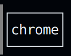
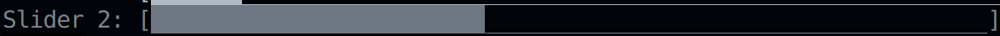
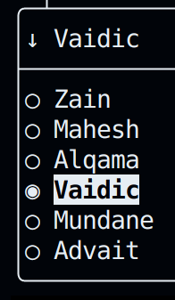
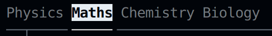

# Quick-FTXUI

A *Quick*, easy way to render terminal user interfaces, using FTXUI.

## Example

It converts this JSON-like code into a TUI

```
Vertical{
    str x
    Button{
        "Open firefox",
        System("/usr/bin/firefox"),
        Animated,
        x
    }
    int y = 20
    Slider {
        "A Slider",
        y,
        0,
        100,
        1
    }
    Horizontal {
        int z = 1
        int w
        Dropdown {
            [ "Zain", "Mahesh", "Alqama", "Vaidic", "Mundane", "Advait", ],
            z
        }
        Toggle {
            [ "On", "Off", ],
            w
        }
    }

    Button {
        "Exit",
        "Exit",
        Ascii
    }
}
```

### Output


## Features
* #### Supports majority of FTXUI components, listed below:
    <details><summary>Button</summary>
    Supports System() calls (like /usr/bin/firefox)

    [Example](./examples/Button.qf)

    
    </details>

    <details><summary>Slider</summary>

    [Example](./examples/Slider.qf)

    

    </details>

    <details><summary>Input</summary>

    [Example](./examples/input.qf)

    

    </details>

    <details><summary>Dropdown</summary>

    [Example](./examples/menu_toggle_dropdown.qf#L15-L18)

    

    </details>

    <details><summary>Menu</summary>

    [Example](./examples/menu_toggle_dropdown.qf#L4-L8)
    
    

    </details>

    <details><summary>Toggle</summary>

    [Example](./examples/menu_toggle_dropdown.qf#L11-14)

    

    </details>

* #### Variables

    Used as hooks, so that we can obtain the input given to the GUI. Currenlty, supports `int` and `str` data types

    Check out the examples in [this directory](./examples/)

* #### Embedded scripting supported in C++

    Supports basic scripting functionality, with functions to add & access the quick-ftxui variables. 
    
    [Full Example](./cpp_examples/example.cpp)

    ```cpp
    using namespace std;
    using namespace quick_ftxui;

    int main() {

    set_int_var("x", 5);
    set_str_var("y", "");
    string source_code = R"(Vertical{
            str z = "init"
            str a
            int o = 0
            Input {
                "Type something...",
                Password,
                y
            }
            Slider {
                "Test: ",
                x,
                0,
                100,
                2
            }
            Button{
                "ls",
                System("/usr/bin/google-chrome-stable"),
                Ascii,
                z
            }
            Menu{
                [ "Physics",  "Maths",  "Chemistry",  "Biology",],
                VerticalAnimated,
                o
            }
            Button {
                "Exit",
                "Exit"
            }
        })";

    parse_qf(source_code);
    ```

    Note: To run this above example, build this repository with examples

## Build instructions:
~~~bash
mkdir build
cd build
cmake .. -G "Ninja" -DQUICK_FTXUI_TESTS=ON
ninja
./quick-ftxui
~~~

## Build with examples:
~~~bash
mkdir build
cd build
cmake .. -G "Ninja" -DQUICK_FTXUI_TESTS=ON -DQUICK_FTXUI_EXAMPLES=ON
ninja
./cpp_examples/quick_ftxui_example
~~~

## Roadmap for v0.0.2 release

- [ ] Adding color (component wise)
- [ ] Adding FTXUI DOM elements
- [ ] Adding a way to use C++ defined variables directly, instead of depending on script-variables 
- [ ] Adding detailed user documentation

## Dependencies

* [FTXUI](https://github.com/ArthurSonzogni/FTXUI), by [Arthur Sonzogni](https://github.com/ArthurSonzogni), for rendering the terminal graphics
* [Boost Spirit](https://github.com/boostorg/spirit), for writing the parser for the custom language

## Acknowledgements

* Special Thanks to [Shreyas Atre](https://github.com/SAtacker) and [Krishna Narayanan](https://github.com/Krishna-13-cyber) for their very crucial [foundational work](https://github.com/SAtacker/quick-ftxui) and mentoring for this project.
* Thanks to [Prit Kanadiya](https://github.com/PritK99) and [Khushi Balia](https://github.com/Khushi-Balia) for their contributions to the rest of the codebase
* Thanks to [Arthur Sonzogni](https://github.com/ArthurSonzogni) for his [FTXUI starter repository template](https://github.com/ArthurSonzogni/ftxui-starter), and his amazing FTXUI library 

### Disclaimer: This project is still in development phase, please use it with caution. Future releases may break some functionality


